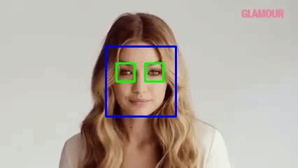

# Face-Eye-Detection-using-Haar-Cascades-in-OpenCV-and-Python
This is the code to detect eyes and face in a video using Haar cascades in OpenCV and Python. 

### This is a sample output of the code on a video:



##### The input video used to test is:
```
https://www.youtube.com/watch?v=n9qH-zwtaCU
```

##### The links for the cascade xml files:
```
https://github.com/Itseez/opencv/blob/master/data/haarcascades/haarcascade_frontalface_default.xml
https://github.com/Itseez/opencv/blob/master/data/haarcascades/haarcascade_eye.xml
```
